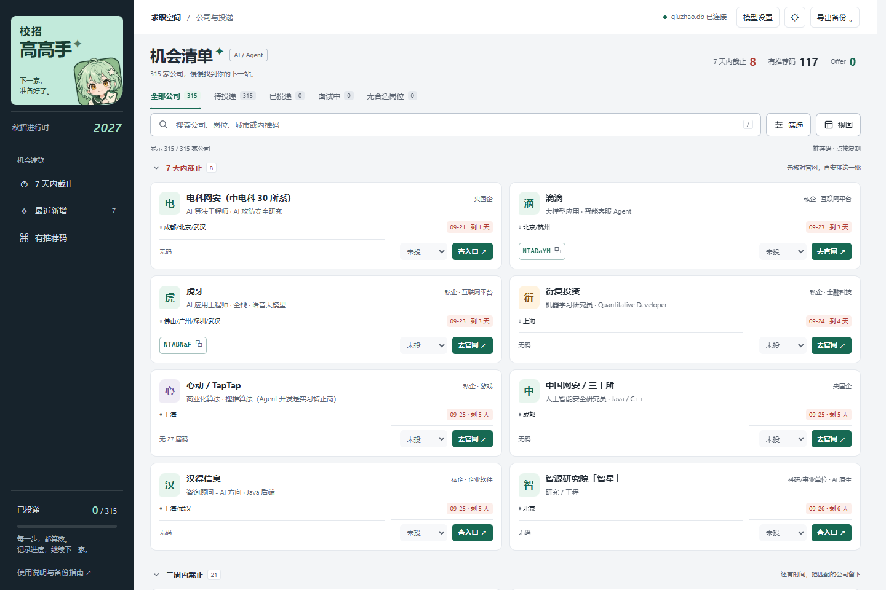
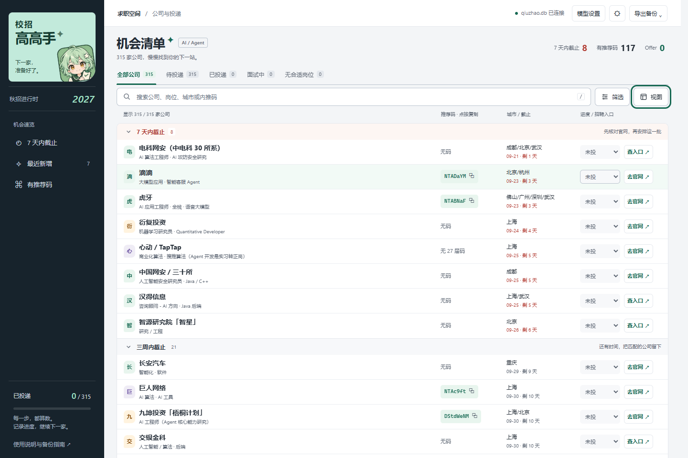
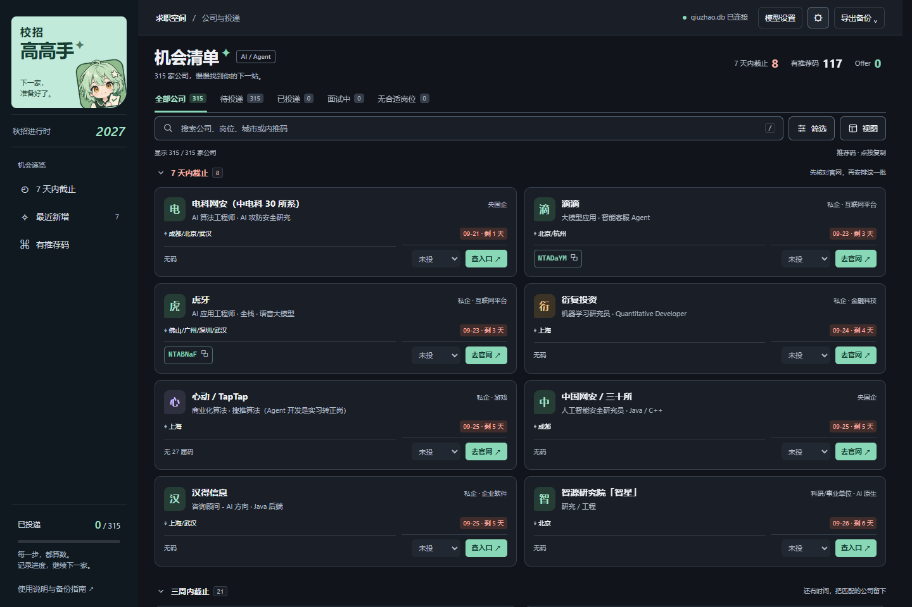
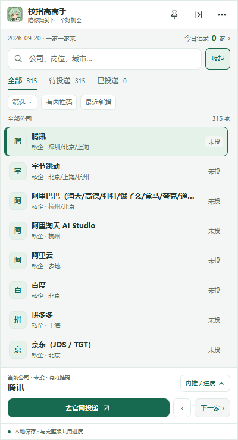
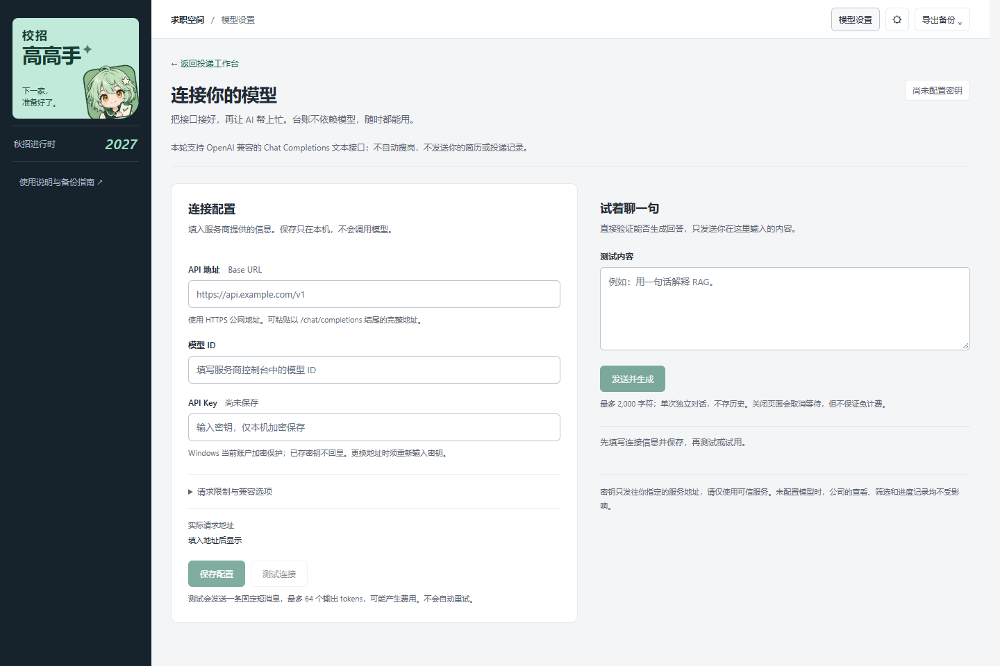

<p align="center">
  <a href="docs/posters/01-opportunity-workspace.png"></a>
</p>

<p align="center">
  <strong>让校招不再散落在几十个浏览器标签页里。</strong><br>
  公司、公开内推线索、投递进度，一个工作台慢慢理清。
</p>

<p align="center">
  <a href="#posters">品牌海报</a> ·
  <a href="#ui">界面预览</a> ·
  <a href="#features">功能导览</a> ·
  <a href="#quick-start">快速开始</a> ·
  <a href="#status">当前进展</a> ·
  <a href="docs/使用指南.md">完整指南</a>
</p>

---

**校招高高手**是面向 AI / Agent 求职的 Windows 本地工作台。用轻巧的界面管理公司与公开招聘线索，打开官网投递，再记下自己的进度。模型是可选工具，不配置也能用台账。

`TypeScript` · `Node.js 24.x` · `SQLite` · `本机保存` · `薄荷石墨`

> **分享版说明** · 当前是公开源码分享版，非免安装 EXE、非在线多人系统。Git 更新代码；每个人的投递记录留在自己的电脑上。

<a name="posters"></a>

## 把下一步，留给从容的自己

**整理机会 · 轻巧陪伴 · 自己掌握。** 三张品牌海报，用同一个小伙伴讲清楚我们想做的工具。

<table>
  <tr>
    <td width="50%"><a href="docs/posters/02-desktop-companion.png"></a></td>
    <td width="50%"><a href="docs/posters/03-local-and-model.png"></a></td>
  </tr>
  <tr>
    <td><strong>02 / 给招聘网页，多留一点空间。</strong><br><sub>贴边收起、固定展开、下一家——兼容版小助手。</sub></td>
    <td><strong>03 / 记录是自己的，模型是可选的。</strong><br><sub>本地保存与备份；主动调用模型会发送输入内容，可能计费。</sub></td>
  </tr>
</table>

<sub>封面及以上两张为品牌创意插画，不是应用实拍；不含简历、个人投递记录、真实公司清单或内推码。实际界面见下方截图。</sub>

[查看三张高清海报与文案](docs/posters/README.md) · [复用设计提示词](docs/posters/prompts.md)

<a name="ui"></a>

## 界面，先看这里

### 01 / 机会清单——下一步，比一屏数字更重要

默认用机会卡片浏览，想多看几家公司时切到紧凑清单。搜索和状态筛选贴近列表，低频条件收进可展开面板；推荐码、截止提醒和官网入口都有各自的位置。



<table>
  <tr>
    <td width="50%"><strong>换一种密度，不换一套习惯。</strong><br><sub>紧凑清单 · 连续浏览更多公司</sub></td>
    <td width="50%"><strong>灯暗下来，信息依然清楚。</strong><br><sub>深色主题 · 同样的布局与操作</sub></td>
  </tr>
  <tr>
    <td><a href="docs/images/workbench-list.png"></a></td>
    <td><a href="docs/images/workbench-dark.png"></a></td>
  </tr>
</table>

### 02 / 贴边小助手——给招聘网页多留一点空间

<table>
  <tr>
    <td width="36%"><a href="docs/images/companion-preview.png"></a></td>
    <td>
      <h3>小窗陪着投，大窗用来看。</h3>
      <p>搜索常驻，筛选能收起，当前公司的操作区按需展开。少一点遮挡，多看几家公司。</p>
      <ul>
        <li>上一家 / 下一家，保持连续浏览。</li>
        <li>展开后复制公开码、核对来源、记录状态。</li>
        <li>今日计数，记录小助手里确认保存的变化。</li>
        <li>原生外壳支持贴边收起和固定。</li>
      </ul>
      <p><strong>版本边界：</strong>配图是旧版浏览器预览，不是原生贴边行为的验收截图。新增 desktop_runtime.py 桌面入口可连接 TypeScript 资料并使用五角色桌宠；旧 launcher.py 仍为独立兼容入口，不要混用资料。</p>
    </td>
  </tr>
</table>

### 03 / 模型设置——先接通，再让 AI 帮上忙

自定义 OpenAI 兼容接口，保存配置、测试连接、实际生成回复分开操作。密钥不回显，调用可停止，失败有提示；不把“已经保存”说成“已经连通”。



<sub>以上截图基于提交 <code>50a5daf</code>，使用独立空白资料或内存测试桥接，仅展示公共目录；没有个人投递记录或真实密钥。截图内日期、公司数和推荐码是版本快照，不代表岗位当前开放或内推码有效。点击图片可查看大图。</sub>

<a name="features"></a>

## 从找到公司，到记下进度

**筛选机会 → 核对来源 → 去官网投递 → 记录与备份**

| 想做的事 | 工作台怎么帮你 |
| :--- | :--- |
| 先看适合自己的公司 | 搜索公司、岗位方向、城市或推荐码；公司性质、行业、状态等条件可叠加，例如「私企＋待投递」。 |
| 不漏掉重要时间 | 按截止日期、行业或性质分组，切换截止优先、公司名称或收录顺序；支持最近新增和分组收起。 |
| 找入口、查内推 | 查看公开推荐码与来源说明，复制后自行核验公司、届别及有效期，跳转招聘入口。 |
| 记清楚投到哪一步 | 保存「未投 / 已投 / 笔试 / 面试 / Offer / 结束 / 无合适岗位」，重新打开可继续。 |
| 让数据留在自己手里 | SQLite 本地保存；提供导出、数据库备份及显式旧进度导入，公共目录与个人进度分开管理。 |
| 接上自己的模型 | 配置公网 HTTPS 的 OpenAI 兼容 Chat Completions 接口；Windows 当前账户加密保存 Key，可测试、生成和取消等待。 |

**一套有温度的工具界面。** 薄荷色标记动作，石墨色承载文字；角色点到为止，列表始终是主角。卡片与清单、明与暗、展开与收起，服务的是不同的浏览节奏。

> 应用中的「已投」是你记录的进度，不是招聘官网的投递回执。小助手今日计数同样不代表真实投递成功。

<a name="quick-start"></a>

## 启动源码版

准备 **Windows、Git、Node.js 24.14 或更高的 24.x**。在 PowerShell 中运行：

```powershell
git clone https://github.com/xiru0834-eng/xiaozhao-gaogaoshou.git
cd xiaozhao-gaogaoshou
npm ci
npm run build
npm start
```

打开 **http://127.0.0.1:18765/**，进入 TypeScript 工作台。第一次是空白投递进度，公共目录以 315 家公司的历史快照初始化。

| 入口 | 当前用途 | 数据关系 |
| :--- | :--- | :--- |
| `18765` · TypeScript 工作台 | 新版界面、独立资料、模型设置 | 默认资料在 `%LOCALAPPDATA%\XiaozhaoGaogaoshou\profiles\typescript-preview\` |
| `18763` · Python 兼容版 | 旧完整台账与原生贴边助手 | 与 TypeScript 版不自动共享进度 |
| `18766` · 可选桌面接入版 | 五角色桌宠、悬浮助手和 TypeScript 服务 | 须显式迁移并配置独立资料；不是拉取即覆盖旧库 |

**不要直接双击 HTML 文件，也不要把两个端口当成同一份资料。** 新版不会自动替换桌面快捷方式或读取旧记录。悬浮助手安装、旧库导入与故障说明见[完整使用指南](docs/使用指南.md)。

<details>
<summary><strong>已经安装？如何更新</strong></summary>

先导出备份并确认保存完成。在仓库目录查看本地改动，再拉取、构建：

```powershell
git status --short
git pull --ff-only
npm ci
npm run build
```

在原服务终端按 `Ctrl+C`，然后重新运行 `npm start`。有本地改动或历史分叉时先停止处理，不强制覆盖。关闭网页不等于停止后台服务。

Git 拉取不会自动搜索新岗位，也不是实时更新推送；不要删除数据库来解决升级或启动问题。

</details>

<a name="status"></a>

## 现在做到哪里了

以下为本轮集成状态；上方截图仍为 `50a5daf` 的历史展示。当前范围与验收见[本次集成记录](docs/20260921-main-integration-validation.md)，后续进展见[任务清单](tasks/todo.md)。

| 模块 | 当前状态 | 说明 |
| :--- | :--- | :--- |
| 工作台与组合筛选 | 已实现 | 机会卡片、紧凑清单、明暗主题、进度保存和导出。 |
| 阶段 1 · 数据基础 | 已实现 | 独立资料、追加式目录、事务导入、备份、资料身份和进程锁；真实旧库迁移需主动执行。 |
| 阶段 2 · 模型接入 | 已实现 | 自定义接口保存、测试与非流式生成；已验证一套真实接口，不承诺兼容每一家服务，自己的配置仍需测试。 |
| 阶段 3 · 岗位采集 | 有界采集与人工确认入库已实现 | 仅已登记来源自动读取；候选须人工核验，不等于全网覆盖或岗位保证可投。 |
| 每日更新与角色来信 | 运行期定时与有界搜索已实现 | 默认关闭；须明确启用、确认模型与额度，退出后台后不会自行唤起。未知 URL 和内推线索仍待核验。 |
| 自动投递 | 未实现 | 不发送招聘消息，不读取短信，不代替你上传简历或递交申请。 |
| 面试日程与求职任务 | 已实现 | 月历、列表、固定时间/截止/窗口/待定任务、状态、改期和人工确认；不确定时间不自动猜。 |
| QQ / Outlook 邮件辅助 | 工程链路已实现，真实账号分别待验收 | QQ IMAP、Outlook 个人/组织授权，邮件分析和逐项核对；确认后入任务与日历，默认不自动授权。 |
| Windows 桌宠与悬浮助手 | 本机接入版 | 五角色、拖动、动画、打开同一资料；无通用安装包或全平台承诺。 |

### 数据与模型，边界说清楚

- **记录留在本机。** 仓库不分享你的投递库、简历、密钥、日志和浏览器缓存；不要把整个日常使用目录打包给别人。
- **模型调用需要授权。** 保存配置不调用模型；测试、生成以及显式开启的定时搜索/邮件分析会发送相应文本给所配置服务，可能计费。邮件内容属于私人信息，开启前核对服务商和分析授权；不会自动附带简历或投递记录。
- **公开线索不是保证。** 315 家公司不等于 315 个仍开放职位；推荐码要核对来源和批次，最终以招聘官网为准。
- **当前仅面向本机。** 不要把本地端口开放到公网；未做干净机器安装包验收。模型暂不支持内网/Ollama、系统代理、自签证书、Responses 协议或流式输出。

## 可选桌面与邮箱功能

- [桌面与桌宠接入](docs/桌面统一升级与桌宠接入-20260921.md)：需先验证外部资料和 `desktop-settings.json`，然后运行 `pythonw desktop_runtime.py --config "配置绝对路径"`；可加 `--companion` 或 `--full`。缺配置会拒绝启动，不悄悄新建空台账。
- [邮件转求职任务](docs/邮件转求职任务-实现与验收.md)：邮件是待确认线索，不直接执行邮件中的指令；日期、时区、链接和变更都应核对。
- [每日更新与角色来信](docs/每日更新与角色来信-实现与验收.md)：定时与一次性来信回执已实现，后台唤起和广泛来源适配仍有边界。

## 给想一起打磨它的人

```text
src/client/    交互、筛选、保存队列、导出与视觉样式
src/server/    本机服务、SQLite、资料隔离、模型与采集基础
src/shared/    公司目录、类型与边界契约
web/           页面结构与 TypeScript 入口
tests/         单元、接口、持久化与安全边界测试
docs/          使用指南、设计说明、需求与验收记录
```

本轮集成前，本机验证 **252 项 TypeScript 测试、92 项 Python 回归测试和类型检查 / 构建通过**。最终候选验收见[集成记录](docs/20260921-main-integration-validation.md)。这不是持续集成徽标，也不是全平台、真实邮箱或模型准确率承诺。

```powershell
npm test
npm run build
python -X utf8 -m unittest -q
```

最后一条需要 Python 和 Git / Node 环境，用于仍保留的兼容版回归。测试使用隔离资料。采集规则的 60 条合成工程用例不代表真实模型准确率，具体限制见[实现与测试记录](docs/阶段3-实现与测试记录.md)。

| 想继续了解 | 从这里开始 |
| :--- | :--- |
| 安装、升级、数据导入与模型配置 | [完整使用指南](docs/使用指南.md) |
| UI 为什么这样排 | [工作台设计](docs/投递工作台-清单式视觉重设计.md) · [悬浮助手设计](docs/悬浮助手-列表优先布局.md) |
| 数据与模型的实现边界 | [数据基础](docs/阶段1-数据基础.md) · [模型设置与验收](docs/模型设置-需求与验收.md) |
| 接下来怎么做采集 | [阶段 3 需求](docs/阶段3-手动岗位采集需求.md) · [实施计划](docs/阶段3-实施计划.md) |
| 分享和本次首页更新 | [共享说明](docs/共享与更新说明.md) · [仓库展示说明](docs/仓库首页展示说明.md) |

仓库暂未选择公开开源许可证；第三方依赖遵守各自许可证。分享请使用仓库链接，不附带个人数据。

---

<p align="center">
  <br>
  <strong>机会，慢慢靠近。</strong><br>
  <sub>每一步，都算数。</sub>
</p>
