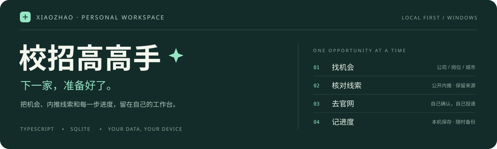

<p align="center">
  
</p>

<p align="center">
  <strong>让校招不再散落在几十个浏览器标签页里。</strong><br>
  公司、公开内推线索、投递进度，一个工作台慢慢理清。
</p>

<p align="center">
  <a href="#ui">界面预览</a> ·
  <a href="#features">功能导览</a> ·
  <a href="#quick-start">快速开始</a> ·
  <a href="#status">当前进展</a> ·
  <a href="docs/使用指南.md">完整指南</a>
</p>

---

**校招高高手**是面向 AI / Agent 求职的 Windows 本地工作台。用轻巧的界面管理公司与公开招聘线索，打开官网投递，再记下自己的进度。模型是可选工具，不配置也能用台账。

`TypeScript` · `Node.js 24.x` · `SQLite` · `本机保存` · `薄荷石墨`

> **分享版说明** · 当前是私有仓库的邀请制源码版，非免安装 EXE、非在线多人系统。Git 更新代码；每个人的投递记录留在自己的电脑上。

<a name="ui"></a>

## 界面，先看这里

### 01 / 机会清单——下一步，比一屏数字更重要

默认用机会卡片浏览，想多看几家公司时切到紧凑清单。搜索和状态筛选贴近列表，低频条件收进可展开面板；推荐码、截止提醒和官网入口都有各自的位置。


<table>
  <tr>
    <td width="50%"><strong>换一种密度，不换一套习惯。</strong><br><sub>紧凑清单 · 连续浏览更多公司</sub></td>
    <td width="50%"><strong>灯暗下来，信息依然清楚。</strong><br><sub>深色主题 · 同样的布局与操作</sub></td>
  </tr>
  <tr>
    <td><a href="docs/images/workbench-list.png"></a></td>
    <td><a href="docs/images/workbench-dark.png"></a></td>
  </tr>
</table>

### 02 / 贴边小助手——给招聘网页多留一点空间

<table>
  <tr>
    <td width="36%"><a href="docs/images/companion-preview.png"></a></td>
    <td>
      <h3>小窗陪着投，大窗用来看。</h3>
      <p>搜索常驻，筛选能收起，当前公司的操作区按需展开。少一点遮挡，多看几家公司。</p>
      <ul>
        <li>上一家 / 下一家，保持连续浏览。</li>
        <li>展开后复制公开码、核对来源、记录状态。</li>
        <li>今日计数，记录小助手里确认保存的变化。</li>
        <li>原生外壳支持贴边收起和固定。</li>
      </ul>
      <p><strong>版本边界：</strong>这是 Python 兼容版助手，与旧版完整台账共享进度；尚未接入 TypeScript 新资料。配图是浏览器预览，不是原生贴边行为的验收截图。</p>
    </td>
  </tr>
</table>

### 03 / 模型设置——先接通，再让 AI 帮上忙

自定义 OpenAI 兼容接口，保存配置、测试连接、实际生成回复分开操作。密钥不回显，调用可停止，失败有提示；不把“已经保存”说成“已经连通”。


<sub>以上截图基于提交 <code>50a5daf</code>，使用独立空白资料或内存测试桥接，仅展示公共目录；没有个人投递记录或真实密钥。截图内日期、公司数和推荐码是版本快照，不代表岗位当前开放或内推码有效。点击图片可查看大图。</sub>

<a name="features"></a>

## 从找到公司，到记下进度

**筛选机会 → 核对来源 → 去官网投递 → 记录与备份**

| 想做的事 | 工作台怎么帮你 |
| :--- | :--- |
| 先看适合自己的公司 | 搜索公司、岗位方向、城市或推荐码；公司性质、行业、状态等条件可叠加，例如「私企＋待投递」。 |
| 不漏掉重要时间 | 按截止日期、行业或性质分组，切换截止优先、公司名称或收录顺序；支持最近新增和分组收起。 |
| 找入口、查内推 | 查看公开推荐码与来源说明，复制后自行核验公司、届别及有效期，跳转招聘入口。 |
| 记清楚投到哪一步 | 保存「未投 / 已投 / 笔试 / 面试 / Offer / 结束 / 无合适岗位」，重新打开可继续。 |
| 让数据留在自己手里 | SQLite 本地保存；提供导出、数据库备份及显式旧进度导入，公共目录与个人进度分开管理。 |
| 接上自己的模型 | 配置公网 HTTPS 的 OpenAI 兼容 Chat Completions 接口；Windows 当前账户加密保存 Key，可测试、生成和取消等待。 |

**一套有温度的工具界面。** 薄荷色标记动作，石墨色承载文字；角色点到为止，列表始终是主角。卡片与清单、明与暗、展开与收起，服务的是不同的浏览节奏。

> 应用中的「已投」是你记录的进度，不是招聘官网的投递回执。小助手今日计数同样不代表真实投递成功。

<a name="quick-start"></a>

## 启动源码版

先接受维护者的 GitHub 邀请，准备 **Windows、Git、Node.js 24.14 或更高的 24.x**。在 PowerShell 中运行：

```powershell
git clone https://github.com/xiru0834-eng/xiaozhao-gaogaoshou.git
cd xiaozhao-gaogaoshou
npm ci
npm run build
npm start
```

打开 **http://127.0.0.1:18765/**，进入 TypeScript 工作台。第一次是空白投递进度，公共目录以 315 家公司的历史快照初始化。

| 入口 | 当前用途 | 数据关系 |
| :--- | :--- | :--- |
| `18765` · TypeScript 工作台 | 新版界面、独立资料、模型设置 | 默认资料在 `%LOCALAPPDATA%\XiaozhaoGaogaoshou\profiles\typescript-preview\` |
| `18763` · Python 兼容版 | 旧完整台账与原生贴边助手 | 与 TypeScript 版不自动共享进度 |

**不要直接双击 HTML 文件，也不要把两个端口当成同一份资料。** 新版不会自动替换桌面快捷方式或读取旧记录。悬浮助手安装、旧库导入与故障说明见[完整使用指南](docs/使用指南.md)。

<details>
<summary><strong>已经安装？如何更新</strong></summary>

先导出备份并确认保存完成。在仓库目录查看本地改动，再拉取、构建：

```powershell
git status --short
git pull --ff-only
npm ci
npm run build
```

在原服务终端按 `Ctrl+C`，然后重新运行 `npm start`。有本地改动或历史分叉时先停止处理，不强制覆盖。关闭网页不等于停止后台服务。

Git 拉取不会自动搜索新岗位，也不是实时更新推送；不要删除数据库来解决升级或启动问题。

</details>

<a name="status"></a>

## 现在做到哪里了

以下以当前展示基线 `50a5daf` 为准，后续进展见[任务清单](tasks/todo.md)。

| 模块 | 当前状态 | 说明 |
| :--- | :--- | :--- |
| 工作台与组合筛选 | 已实现 | 机会卡片、紧凑清单、明暗主题、进度保存和导出。 |
| 阶段 1 · 数据基础 | 已实现 | 独立资料、追加式目录、事务导入、备份、资料身份和进程锁；真实旧库迁移需主动执行。 |
| 阶段 2 · 模型接入 | 已实现，真实接口待使用者核验 | 自定义接口保存、测试与非流式生成；已做本机合成服务和 Windows 加密测试，不承诺兼容每一家服务。 |
| 阶段 3 · 岗位采集 | 基础模块开发中 | 已提交受限公开来源读取、证据校验和匹配规则；网页、模型与目录尚未串成完整采集流程。 |
| 每日自动更新、自动投递 | 尚未实现 | 不会后台替你搜岗、发送消息、读取短信或上传简历。 |
| 笔试 / 面试日程备忘录 | 尚未实现 | 可以记录「笔试 / 面试」状态，不等于已有日程、提醒或备忘录。 |

### 数据与模型，边界说清楚

- **记录留在本机。** 仓库不分享你的投递库、简历、密钥、日志和浏览器缓存；不要把整个日常使用目录打包给别人。
- **模型调用由你触发。** 保存配置不调用模型；测试和生成会把相应文本发送给指定服务，可能计费，不自动重试，也不自动附带简历。
- **公开线索不是保证。** 315 家公司不等于 315 个仍开放职位；推荐码要核对来源和批次，最终以招聘官网为准。
- **当前仅面向本机。** 不要把本地端口开放到公网；未做干净机器安装包验收。模型暂不支持内网/Ollama、系统代理、自签证书、Responses 协议或流式输出。

## 给想一起打磨它的人

```text
src/client/    交互、筛选、保存队列、导出与视觉样式
src/server/    本机服务、SQLite、资料隔离、模型与采集基础
src/shared/    公司目录、类型与边界契约
web/           页面结构与 TypeScript 入口
tests/         单元、接口、持久化与安全边界测试
docs/          使用指南、设计说明、需求与验收记录
```

本轮合入 `50a5daf` 前，本机验证 **127 项 TypeScript 测试、70 项 Python 回归测试和类型检查 / 构建通过**。这是对应提交的验证记录，不是持续集成徽标，也不是全平台或真实模型验收。

```powershell
npm test
npm run build
python -X utf8 -m unittest -q
```

最后一条需要 Python 和 Git / Node 环境，用于仍保留的兼容版回归。测试使用隔离资料。采集规则的 60 条合成工程用例不代表真实模型准确率，具体限制见[实现与测试记录](docs/阶段3-实现与测试记录.md)。

| 想继续了解 | 从这里开始 |
| :--- | :--- |
| 安装、升级、数据导入与模型配置 | [完整使用指南](docs/使用指南.md) |
| UI 为什么这样排 | [工作台设计](docs/投递工作台-清单式视觉重设计.md) · [悬浮助手设计](docs/悬浮助手-列表优先布局.md) |
| 数据与模型的实现边界 | [数据基础](docs/阶段1-数据基础.md) · [模型设置与验收](docs/模型设置-需求与验收.md) |
| 接下来怎么做采集 | [阶段 3 需求](docs/阶段3-手动岗位采集需求.md) · [实施计划](docs/阶段3-实施计划.md) |
| 分享和本次首页更新 | [共享说明](docs/共享与更新说明.md) · [仓库展示说明](docs/仓库首页展示说明.md) |

仓库暂未选择公开开源许可证；第三方依赖遵守各自许可证。分享请使用仓库邀请，不附带个人数据。

---

<p align="center">
  <br>
  <strong>机会，慢慢靠近。</strong><br>
  <sub>每一步，都算数。</sub>
</p>
