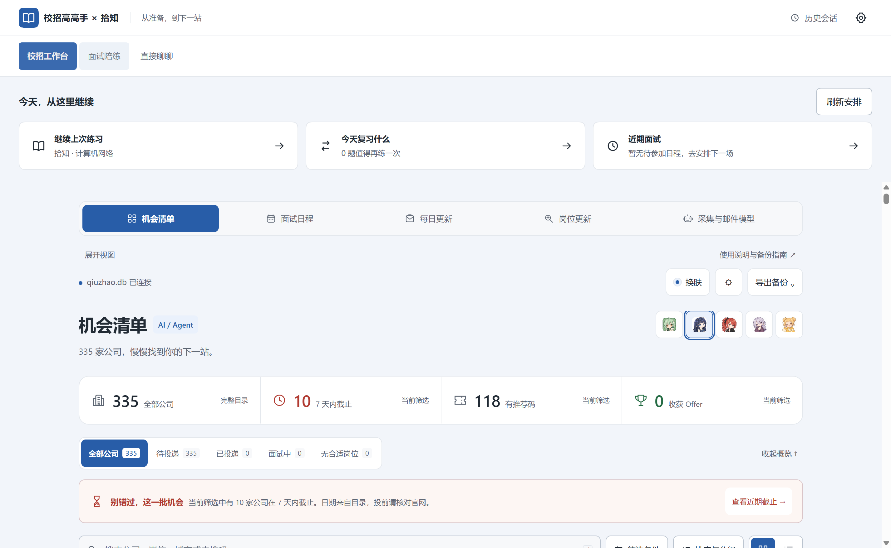
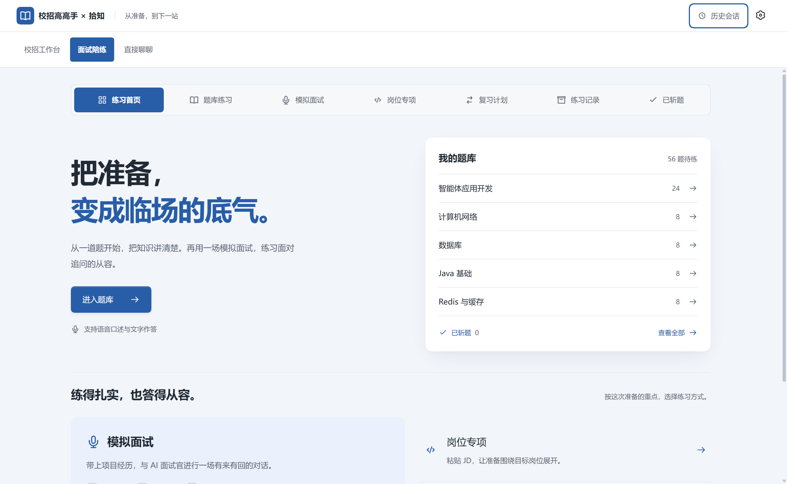
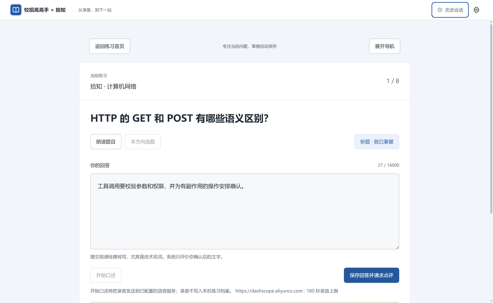
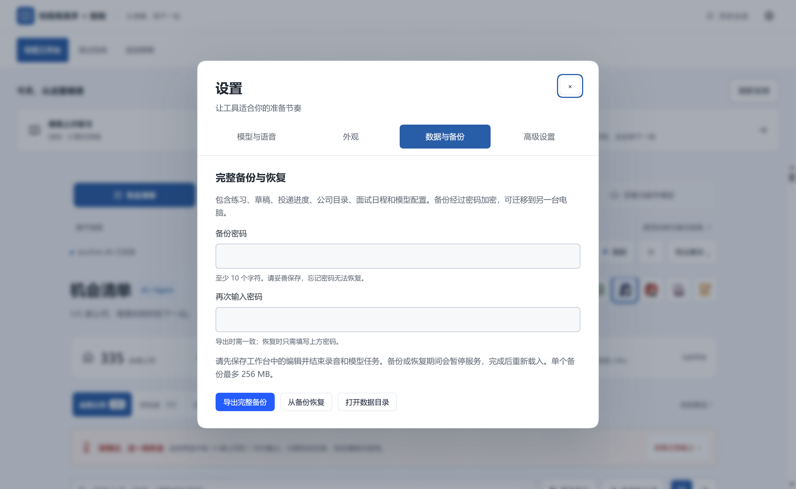

# 校招高高手 × 拾知

**从找到机会，到把面试准备好。** 一个在本机保存数据的校招工作台与 AI 面试陪练，支持 Windows 桌面窗口和本地网页版。

[快速开始](#快速开始) · [界面预览](#界面预览) · [项目结构](#项目结构) · [使用指南](docs/使用指南.md) · [桌面版说明](products/shizhi-desktop/README.zh.md)

## 可以做什么

| 功能 | 使用方式 |
| --- | --- |
| 校招工作台 | 搜索公司、筛选岗位线索、记录投递进度，查看截止日期，导出与备份。 |
| 题库练习 | 232 道原创口述题，其中 200 道面向智能体应用开发；自由选题，文字或语音回答。 |
| 点评与复习 | 查看答对、有误和遗漏的知识点、参考讲解与重答对比；掌握后斩题，之后可恢复。 |
| 模拟面试 | 提供 JD 与项目经历，由 AI 生成问题、连续追问，结束后复盘。 |
| 岗位专项 | 从公司卡片进入准备流程，将岗位背景、问答和练习记录关联起来。 |
| 日程与求职任务 | 管理面试日历、待办和进度；岗位采集、每日更新与邮件分析按需配置并人工核对。 |
| 草稿与专注 | 回答自动保存到本机，刷新后恢复；作答时收起导航，可随时展开。 |
| 今日安排 | 继续最近练习、查看待复习题目和下一场面试日程。 |
| 桌面与外观 | Windows 独立窗口、顶部导航、历史会话、全局浅色／深色／跟随系统，以及角色配色。 |

浏览公司、记录进度、选题和保存回答不需要模型密钥。AI 点评、生成面试题和语音转写需要自己的服务配置；调用费用取决于服务商与账号额度。

## 界面预览

### 校招工作台



### 面试陪练



截图来自真实 Electron 应用的独立演示资料，使用公共公司目录和示例练习，不含个人投递数据或密钥。角色插画与历史品牌海报见 [视觉素材](docs/posters/README.md)。

<details>
<summary>查看专注作答与统一设置</summary>




</details>

## 快速开始

### Windows 桌面版

使用维护者提供的 `Xiaozhao-Setup-0.1.4-x64.exe` 安装，随后打开「校招高手」快捷方式。安装包内置运行环境，使用者不需要安装 Node、Python 或 Git。安装包不存放在 Git 源码中；需要自行构建时按 [桌面版说明](products/shizhi-desktop/README.zh.md#从源码构建)操作。

首次打开可填写模型和语音密钥，也可以先跳过。右上角 **设置** 集中提供模型与语音、全局外观、数据备份及高级设置；其他供应商和开发者选项在 **高级设置** 中管理。当前桌面包为未签名测试版，尚无自动更新。

### 从源码启动融合版

准备 Git、Node.js **24.14 或更新的 24.x**、npm 和 pnpm。在终端执行：

```powershell
git clone https://github.com/xiru0834-eng/xiaozhao-gaogaoshou.git
cd xiaozhao-gaogaoshou
npm ci
npm run coach:install
npm start
```

打开终端输出的本地私有链接，默认端口为 `4317`。首页提供 **校招工作台、面试陪练、直接聊聊**，无需选择工作区。不要直接双击 HTML 文件。停止服务时在原终端按 `Ctrl+C`。

源码版的语音配置、千问密钥和模型设置见 [面试陪练说明](products/shizhi-interview/README.zh.md)。仅运行独立校招工作台、旧 Python 工具或桌宠时，见 [使用指南](docs/使用指南.md)。这些入口使用各自的数据目录，不会自动迁移个人记录。

## 数据与使用范围

- **个人记录保存在本机。** 桌面版使用 `%APPDATA%\XiaozhaoShizhi`；源码融合版使用 `products/shizhi-interview/.dsh-home`。API Key、数据库、日志和构建文件不进入 Git。
- **备份需区分范围。** 工作台的导出菜单可下载公司目录或投递进度；桌面版可通过 **设置 → 数据与备份** 导出密码加密的完整备份，并在另一台电脑恢复；具体见 [桌面数据说明](products/shizhi-desktop/README.zh.md#数据与配置)。
- **模型会收到主动提交的内容。** AI 点评、生成、语音转写、岗位搜索或邮件分析会向已配置的服务发送相应输入；邮件账号需自行授权，每日更新需主动启用。
- **公开线索需要核实。** 内置公司目录来自历史快照，岗位、截止日期和推荐码以招聘官网为准。题库是原创知识练习，不是经核实的公司真题，AI 点评也可能有误。
- **这是单机求职工具。** 当前没有账号、订阅付费、多人数据同步、自动投递或关闭后台后的自动唤醒。真实邮箱、模型服务和麦克风需在自己的环境中验证。

## 项目结构

```text
products/
  shizhi-desktop/       Electron 桌面版、首次配置、打包与运行时检查
  shizhi-interview/     面试陪练、题库、语音、点评与工作台整合
  legacy-desktop/      Python 兼容工具、桌宠及旧版页面
    scripts/           预览、迁移和原生窗口验证工具
    tests/             Python 回归测试
src/
  client/              校招工作台交互与样式
  server/              本机服务、SQLite、采集、邮件与日程
  shared/              公司目录和公共类型
web/                   校招网页入口与网页静态素材
assets/                共享品牌与桌宠素材
scripts/               仓库开发辅助脚本
tests/                 TypeScript 测试与样本
docs/                  使用指南、界面截图、设计与历史验收记录
tasks/                 产品规划与任务记录
```

根目录保留 README、`package.json`、锁文件、TypeScript / Vite 与 Git 配置，方便依赖安装和构建。Python 文件及测试已归入 [legacy-desktop](products/legacy-desktop/README.md)；产品设计说明在 [docs/PRODUCT.md](docs/PRODUCT.md)。

## 开发与协作

`main` 是完整产品的共同基线。独立功能使用短期分支，验证并合入后清理，避免把长期版本分散到多个功能分支。更新前保存本地修改并备份数据，再使用 `git pull --ff-only`；有冲突时不要强制覆盖。

按改动范围运行检查：

```powershell
npm run build          # 校招前端、类型与后端构建
npm test               # TypeScript 回归
npm run coach:check    # 面试陪练构建与回归
npm run test:legacy    # Python 工具回归，需要 Python、Git 和 Node
```

Python 工具测试依赖已构建的 TypeScript 后端；桌面打包和真实窗口验证见 [桌面开发说明](products/shizhi-desktop/README.zh.md#验证与实现)。历史验收记录各自注明日期和范围，不代表所有平台及服务都已通过验证。

| 继续了解 | 文档 |
| --- | --- |
| 安装、启动、模型与入口区别 | [使用指南](docs/使用指南.md) |
| 语音、练习、题库和点评 | [面试陪练](products/shizhi-interview/README.zh.md) |
| Electron 安装、数据目录与打包 | [Windows 桌面版](products/shizhi-desktop/README.zh.md) |
| 旧 Python 台账和可选桌宠 | [兼容工具](products/legacy-desktop/README.md) |
| 邮件与求职任务 | [邮件任务说明](docs/邮件转求职任务-实现与验收.md) |
| 每日更新 | [实现与使用边界](docs/每日更新与角色来信-实现与验收.md) |

仓库尚未选择统一的公开开源许可证。DeepSeek Harness 等第三方依赖保留各自许可证与声明；分享项目请使用仓库链接，不附带个人数据。
